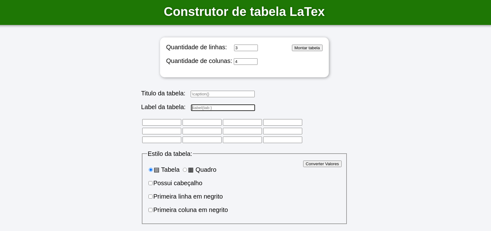

# Construtor de tabelas no formato LaTex

# Sobre o projeto

Link do projeto: https://guilhermesetim.github.io/construtor-tabela-latex/

Ferramenta web para construção facilitada de tabelas no formato LaTex, em que o usuário informa as propriedades da tabelas, seus respectivos valores, e recebe um código para copiar e colar em seu documento .tex

O LaTex um sistema de preparação de documentos, utiliza-se de *tagging* de marcação para definir a estrutura geral do documento, e para formatar o texto, além de adicionar citações e referências. 

Entretanto, a construção de tabelas nesse sistema de marcação acaba sendo muito trabalhosa, o objetivo dessa ferramenta é facilitar e agilizar a construção do código LaTex para o usuário.

# Como executar o projeto
A ferramenta foi desenvolvida com o propósito de ser intuitiva para o usuário:
1. Acessar o link do projeto: https://guilhermesetim.github.io/construtor-tabela-latex/
2. Informar a quantidade de linhas e colunas que sua tabela apresenta;
3. Inserir o título da tabela;
4. Inserir a *label* da tabela;
5. Inserir os valores que cada célula da tabela deverá apresentar;
6. Selecionar entre tabela ou quadro;
7. Selecionar as propriedades que a tabela ou quadro apresentam;

Realizado essas etapas e clicando no botão "Converter Valores",  será gerado um código LaTex para copiar e colar em um documento .tex

## Layout
 

## Tecnologias utilizadas
- HTML 5;
- CSS 3;
- JavaScript;

## Plataformas
- Browser

# Autor

Guilherme Setim